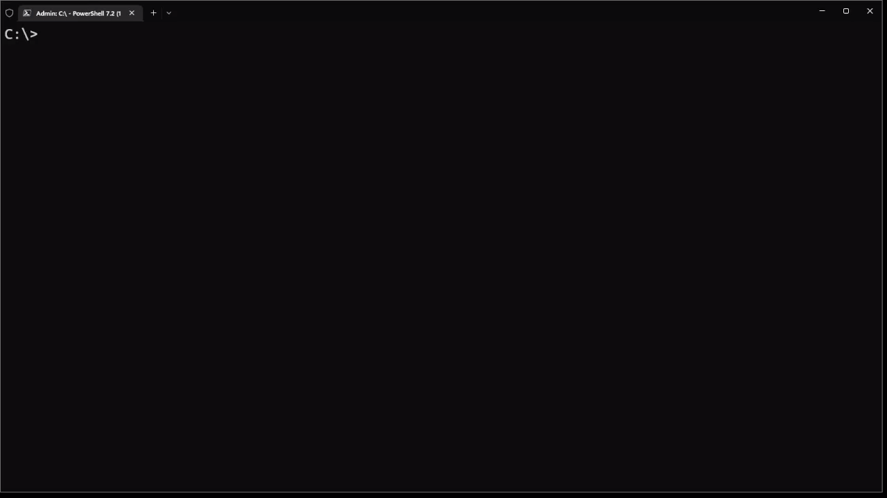

# chocolatey-cli-updater
## this program provides interactive CLI for "choco upgrade" command

can be easily added into powershell $PROFILE:
```powershell
function Choco-Upgrade-Apps() {
    & "C:\path_to_binary\main.exe"
}
```
usage:

